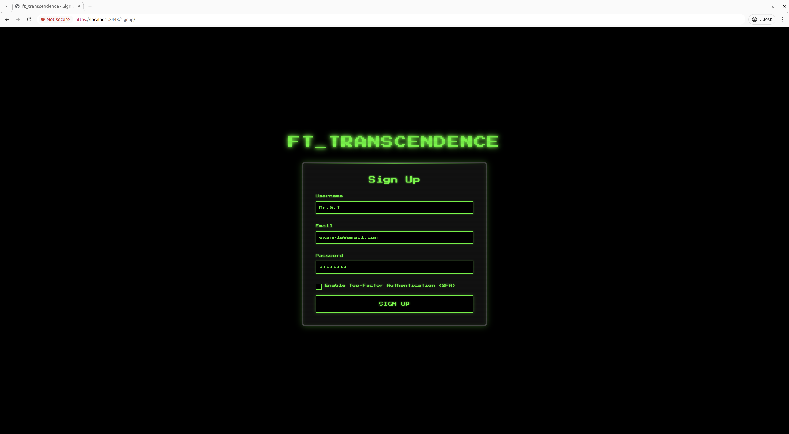
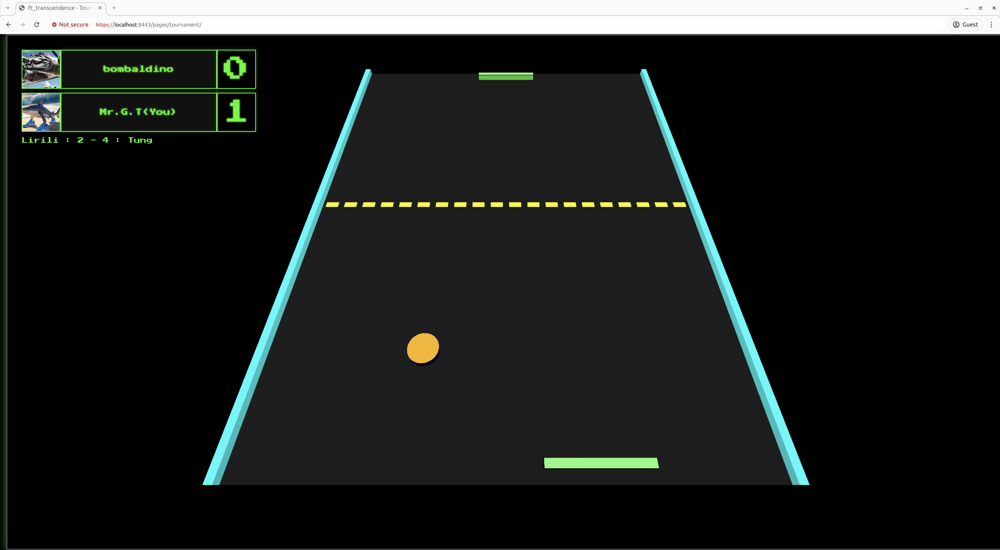
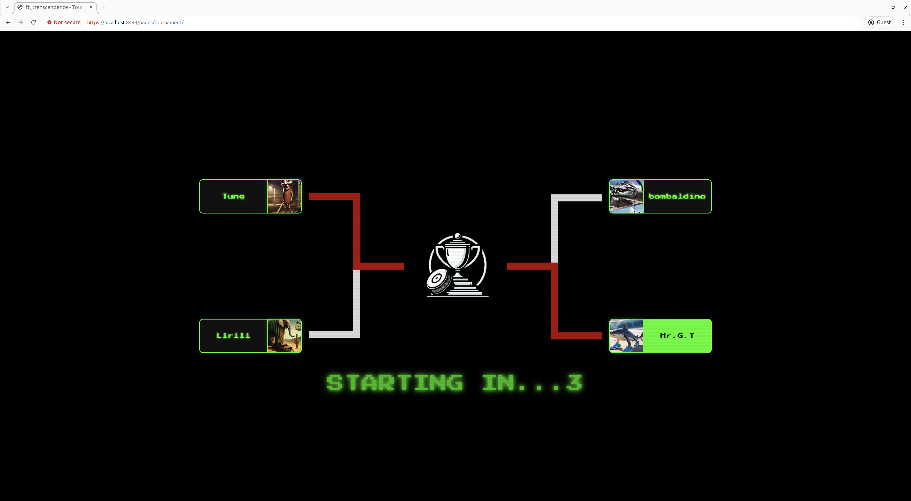

# ft_transcendence


## 概要(Overview)

リアルタイムで対戦できるPongゲーム対戦ができるWebアプリを作成しました

## 主な機能(Features)

- ユーザー認証（JWT認証、2FA認証）
- 多言語対応（日本語・英語・フランス語）
- リアルタイム対戦（WebSocket使用）
- トーナメント対戦

## 使用技術 (Tech Stack)

- フロントエンド：HTML / CSS / JavaScript / Bootstrap / three.js
- バックエンド：Django
- WebSocket：Django Channels
- DB：PostgreSQL
- その他：Docker,nginx

## セットアップ方法 (Setup)
### 必要要件 (Requirements)
- Docker & Docker Compose

### 手順 (Steps)
#### リポジトリをクローン
HTTPS:
```bash
git clone https://github.com/Naoki427/ft_transcendence.git
```
SSH:
```bash
git clone git@github.com:Naoki427/ft_transcendence.git
```
#### リポジトリに移動
```bash
cd ft_transcendence
```
#### Makefileで起動
```bash
make
```

起動後、ブラウザで以下のURLにアクセスしてください：  
https::/localhost:8443
## 画面イメージ (Screenshots)



